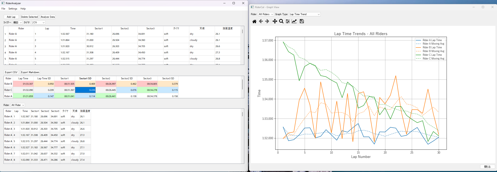

# RiderAnalyzer

## 概要
RiderAnalyzerは、モーターサイクルレースのライダーパフォーマンスを分析・可視化するためのデスクトップアプリケーションです。ラップタイムやセクタータイムのデータを詳細に分析し、ライダーのパフォーマンス向上に役立つ洞察を提供します。



## 主な機能
- 🏍️ **ラップタイム分析**: ラップタイムの傾向を視覚化し、パフォーマンスの変化を追跡
- 🔄 **セクター比較**: 各セクターのタイムを詳細に分析し、改善すべきエリアを特定
- 📊 **複数ライダー比較**: 異なるライダーのパフォーマンスを比較して戦略を立案
- 📈 **グラフ表示**: 5種類のグラフタイプで様々な視点からデータを可視化
- 💾 **データ管理**: JSON/CSV形式でのデータのインポート/エクスポート
- 🌡️ **環境情報記録**: タイヤタイプ、天候、路面温度などの走行条件を記録

## クイックスタート

### 必要条件
- Windows 10/11（64ビット推奨）
- Python 3.8以上

### インストール
```bash
# リポジトリをクローン
git clone https://github.com/TakeshiArai-18/RiderAnalyzer.git

# ディレクトリに移動
cd RiderAnalyzer/scripts

# 環境セットアップ（仮想環境を作成し、依存ライブラリをインストール）
create_venv.bat
```

### 実行
```bash
# アプリケーションを起動
run_app.bat
```

### サンプルデータの生成
```bash
# テスト用のサンプルデータを生成
python generate_sample_data.py
```

## 使用方法

1. アプリを起動し、JSONまたはCSVデータをロード（または新規作成）
2. 「Add Lap」ボタンでラップデータを追加
3. 「Analyze Data」ボタンでデータを分析
4. 様々なグラフタイプでデータを可視化
5. データはJSON/CSVファイルとして保存可能（トラック名と日付が自動的にファイル名に反映）

## 技術スタック
- **フレームワーク**: PyQt5
- **データ処理**: pandas, numpy
- **可視化**: matplotlib, seaborn, plotly

## 詳細ドキュメント
詳細な使用方法については、[ユーザーマニュアル](./rider-analyzer-manual.md)をご参照ください。

## 開発者情報
- 開発者: TakeshiArai-18
- バージョン: 1.0
- ライセンス: Copyright © 2025
